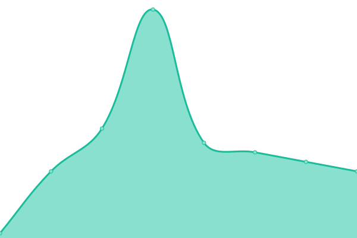
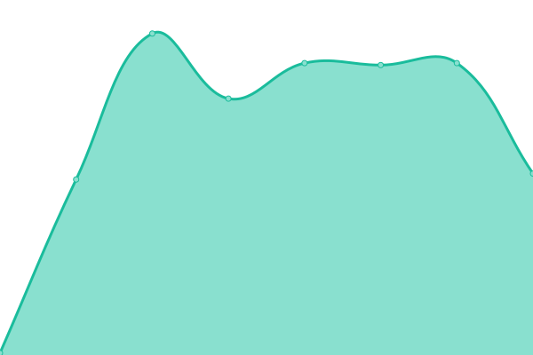
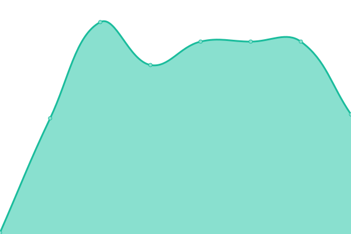

# [📈 Live Status](https://status.stellar-corp.net): <!--live status--> **🟩 All systems operational**

This repository contains the open-source uptime monitor and status page for [Stellar Corporation](https://Yukiko.app), powered by [Upptime](https://github.com/upptime/upptime).

With [Upptime](https://upptime.js.org), you can get your own unlimited and free uptime monitor and status page, powered entirely by a GitHub repository. We use [Issues](https://github.com/Yukiko-Dev-Team/upptime/issues) as incident reports, [Actions](https://github.com/Yukiko-Dev-Team/upptime/actions) as uptime monitors, and [Pages](https://status.stellar-corp.net) for the status page.

<!--start: status pages-->
<!-- This summary is generated by Upptime (https://github.com/upptime/upptime) -->
<!-- Do not edit this manually, your changes will be overwritten -->
<!-- prettier-ignore -->
| URL | Status | History | Response Time | Uptime |
| --- | ------ | ------- | ------------- | ------ |
|  [Yukiko.app](https://yukiko.app) | 🟩 Up | [yukiko-app.yml](https://github.com/Yukiko-Dev-Team/Uptime/commits/HEAD/history/yukiko-app.yml) | 

 98ms
     
 | 

<a href="https://status.stellar-corp.net/history/yukiko-app">55.47%</a>
    

|  [Beta Yukiko.app](https://beta.yukiko.app) | 🟩 Up | [beta-yukiko-app.yml](https://github.com/Yukiko-Dev-Team/Uptime/commits/HEAD/history/beta-yukiko-app.yml) | 

 99ms
     
 | 

<a href="https://status.stellar-corp.net/history/beta-yukiko-app">55.17%</a>
    

|  [Gateway](https://Gateway.yukiko.app) | 🟩 Up | [gateway.yml](https://github.com/Yukiko-Dev-Team/Uptime/commits/HEAD/history/gateway.yml) | 

 108ms
     
 | 

<a href="https://status.stellar-corp.net/history/gateway">55.38%</a>
    

|  Network JP | 🟩 Up | [network-jp.yml](https://github.com/Yukiko-Dev-Team/Uptime/commits/HEAD/history/network-jp.yml) | 

 267ms
     
 | 

<a href="https://status.stellar-corp.net/history/network-jp">100.00%</a>
    

|  Network USA | 🟩 Up | [network-usa.yml](https://github.com/Yukiko-Dev-Team/Uptime/commits/HEAD/history/network-usa.yml) | 

 81ms
     
 | 

<a href="https://status.stellar-corp.net/history/network-usa">100.00%</a>
    

|  Network EU | 🟩 Up | [network-eu.yml](https://github.com/Yukiko-Dev-Team/Uptime/commits/HEAD/history/network-eu.yml) | 

 232ms
     
 | 

<a href="https://status.stellar-corp.net/history/network-eu">100.00%</a>
    

|  bot | 🟩 Up | [bot.yml](https://github.com/Yukiko-Dev-Team/Uptime/commits/HEAD/history/bot.yml) | 

 232ms
     
 | 

<a href="https://status.stellar-corp.net/history/bot">100.00%</a>
    

<!--end: status pages-->

[**Visit our status website →**](https://status.stellar-corp.net)

## 📄 License

- Powered by: [Upptime](https://github.com/upptime/upptime)
- Code: [MIT](./LICENSE) © [Stellar Corporation](https://Yukiko.app)
- Data in the `./history` directory: [Open Database License](https://opendatacommons.org/licenses/odbl/1-0/)
